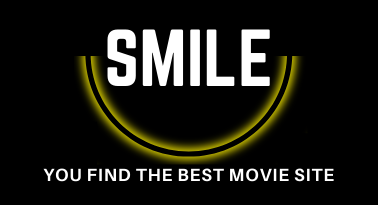

<a name="top"></a>


<h1 align="center" >Front Rental Movie</h1>

<p align="center">
  
</p>


<br/>
<br/>
<br/>


:speech_balloon: [About](#id1)   

:hammer: [Tools](#id2)

:clipboard: [Instructions](#id3)

:eye_speech_bubble: [Phase I - Creating the Backend](#id4)

:eye_speech_bubble: [Phase II - Creating the Frontend](#id5)

:collision: [Coming Soon](#id7)

:smile: [Thanks](#id8)

---

<a name="id1"></a>
## **About**

This is the frontend for a future movie rental application.

Currently, the search for movies and series is being carried out by connecting to the free API the Movie Database.

This project is part of the [GeeksHubs Academy](https://bootcamp.geekshubsacademy.com/) Full Stack Developer Bootcamp. 

---
**Phase I**
Backend - If you want to see the repository visit: https://github.com/mlfernandez/proyecto4Backend_Movie

**Phase II**
**Start date:** 21 / Jun /2021
**Deadline:** 07 / Jul / 2021

**Contributors:**
* [Mariana Fernández Sacristán](https://github.com/mlfernandez)

---

<a name="id2"></a>

## **Tools**

To create this project we worked with these tools and technologies:

|  | Visual Studio Code |

|  | JavaScript | 

|  | NODE JS & EXPRESS |

|  | AXIOS | 

|  | Git |

|  | GitHub | 

|  | The Movie Database API | 

|  | React | 

|  | Redux | 

|  | Sequelize | 

|  | Sass | 


<a name="id3"></a>
***
## **Instructions**


<h3> Starting the project </h3>
   
We need to install:

```javascript
npx create-react-app "name"
npm i react-router-dom
npm i --save redux
npm install --save react-redux
npm i --save redux-localstorage-simple
npm i axios
```


<a name="id4"></a>
## Phase I Creating the Backend

If you want to know about the Phase I, you can see the backend repository here.


<a name="id5"></a>
## Phase II - Creating the Frontend
### Required endpoints

* Usuario login/logout.
* Vista área cliente.
* Alquier película.
* Busqueda pelicula por título y genero.
* Alquileres en marcha.
* Vista administrador de todos los alquileres de todos los usuarios.

### Required endpoints

##### Vista Registro de Usuario
<br>
<br>

<br>
<br>
##### Vista Panel de Usuario
<br>

<br>
<br>
##### Vista Panel de Admin
<br>


<a name="id6"></a>
***
## **Coming Soon**

* Deploy with Heroku.


<a name="id7"></a>
***
## **Thanks**

I would like to thank all my partners, always ready to solve doubts. 

<br>
<br>

[UP](#top)